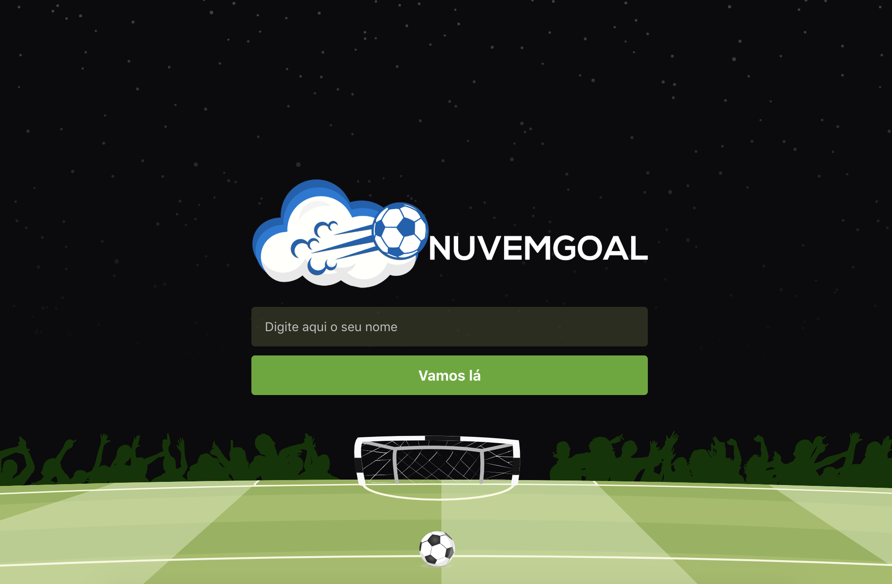

# NuvemGoal

Este app é baseado na __classificação__ de times.

O app faz a utilização de __LOCALSTORAGE__, não consumindo banco de dados ou api.

Conforme __critérios__ pré-estabelecidos, e o decorrer dos jogos, a tabela de classificação demonstra quais os times estão nas primeiras colocações.

### Critérios

* Vitórias

* Gols

* Empates

* Derrotas

---

### Validações

- Nome de usuário obrigatório.
- No pré-jogo é obrigatório a seleção de dois times diferentes para iniciar a partida.
- No lançamento de gols, é obrigatório informar o time e o jogador.

# Screenshots

## License

This project is licensed under the MIT License - see the [LICENSE.md](LICENSE.md) file for details

